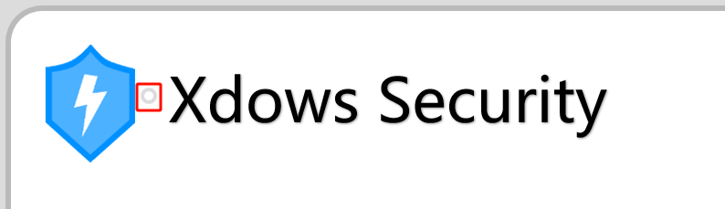

::: warning 注意
此版本已過期。建議查看最新的 [Xdows Security 4.1](/zh-HANT/Xdows-Security-4.1/get-started) 版本。
:::

# Windows 用戶端

## 介紹 {#Info}
`Windows` 平台用戶端從 `Xdows Security 4.0 Beta-7` 開始引入。

用戶端使用 `ACF Browser Framework` 構建。

::: details 關於 ACF Browser Framework
原作者：Admenri

注意：使用此專案時請注意相關授權。

相關連結：[這裡（中文頁面）](https://bbs.125.la/forum.php?mod=viewthread&tid=14845602)
:::

## 開發人員工具 {#DevTools}

在一般模式下，用戶端會停用操作功能表，並且不允許使用 `F12` 或 `Ctrl Shift J` 等快捷鍵開啟 `開發人員工具`。

您可以點擊標題列圖示旁邊的按鈕（如下圖所示）。點擊後，可能需要幾秒鐘才能開啟 `開發人員工具`。



> [!IMPORTANT] 找不到此按鈕？
> 如果您的色彩模式設定為 `深色模式`
>
> 此按鈕將會隱藏。請切換到 `淺色模式` 以繼續。

## 用戶端通訊 {#Communication}

在 `用戶端` 的瀏覽器環境中，您可以透過 `Client` 類別與它通訊。

您可以使用 `postMessage` 來執行用戶端介面。用法如下：

```js
if (top.getBrowserType() == 'Client'){
    Client.postMessage(
        "FunctionName",
        "Parameter1",
        "Parameter2",
        "Parameter3",
        "..."
    );
};
```

### ChangeTheme {#ChangeTheme}

此函數用於變更用戶端視窗主題（相關色彩）。範例：

```js
if (top.getBrowserType() == 'Client'){
    Client.postMessage(
        "ChangeTheme",
        "Parameter1", // --Background-color 變數值
        "Parameter2", // --Text-color 變數值
        "Parameter3", // --Theme-color 變數值
        "Parameter4", // --Theme-Background-color 變數值
        "Parameter5"  // light 或 dark
    );
};
```
