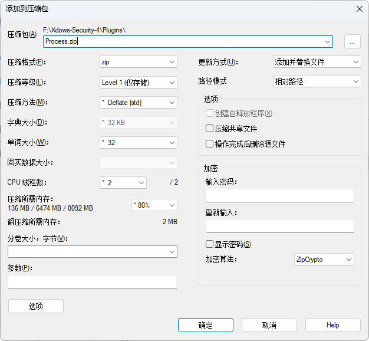
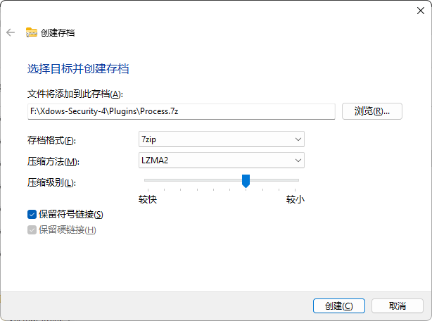
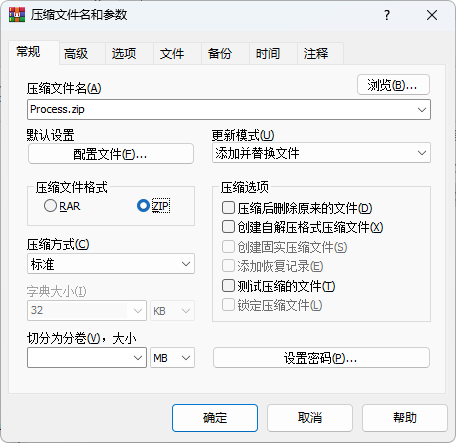
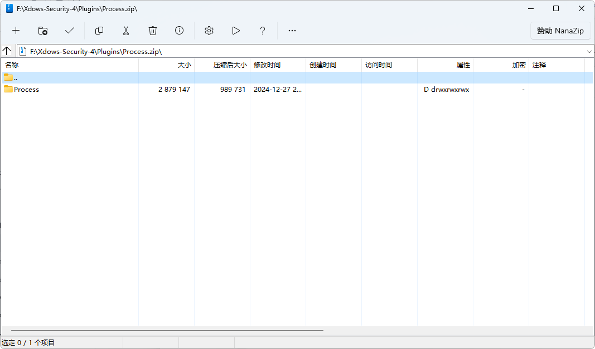

::: warning 注意
該版本已過時。建議查看最新的 [Xdows Security 4.1](/zh-HANT/Xdows-Security-4.1/get-started) 版本。
:::

# 製作外掛包

## 壓縮軟體

理論上可以使用基本所有支援壓縮 ZIP 的軟體。

但是推薦使用開源軟體 `7-Zip`，因為它具有高效的壓縮演算法和廣泛的相容性。

本文章使用基於 `7-Zip` 的軟體 `NanaZip`。

其它軟體可能顯示介面有所不同，但操作步驟大致相同。

## 準備外掛內容

在開始壓縮之前，請確保外掛目錄的結構正確。一個標準的外掛目錄結構如下：

```
PluginName/
├── Data/
│   └── ...
└── Files/
    ├── Main.dll
    └── ...
```

請確保 `Main.dll` 文件位於 `Files` 資料夾中，並且所有必要的數據文件都存放在 `Data` 資料夾中。

## 壓縮外掛目錄

1. 在外掛目錄上按右鍵，選擇 `添加到壓縮包`。

2. 在彈出的視窗中選擇以下選項：

   - 壓縮格式：zip
   - 壓縮等級：Level 1（快速壓縮，適合外掛包）

   

   以下是一些其它壓縮軟體的示例截圖：

   ::: details Windows 檔案總管
      
   :::
   ::: details WinRAR
      
   :::

3. 確認選項後，點擊 `確定` 開始壓縮。

## 驗證壓縮結果

壓縮完成後，檢查生成的 ZIP 文件是否符合以下目錄結構：

```
Plugin.zip
├── PluginName/
│   ├── Data/
│   │   └── ...
│   └── Files/
│       ├── Main.dll
│       └── ...
```

可以通過解壓縮文件並檢查內容來驗證。

## 多外掛外掛包

直接選擇多個外掛一起壓縮即可，完成後像這樣：

```
Plugin.zip
├── PluginName1/
│   ├── Data/
│   │   └── ...
│   └── Files/
│       ├── Main.dll
│       └── ...
├── PluginName2/
│   ├── Data/
│   │   └── ...
│   └── Files/
│       ├── Main.dll
│       └── ...
└── ...
```

## 最終示例

以下是一個以 Process 外掛為例的壓縮包內容截圖：



## 常見問題

1. 壓縮後文件結構不正確
   - 請檢查外掛目錄的初始結構是否符合要求。
   - 確保在壓縮時選擇了正確的選項。

2. 壓縮包無法被識別
   - 確保使用的是 ZIP 格式。

3. 壓縮等級選擇問題
   - Level 1 是推薦的壓縮等級，既能保證速度又能提供足夠的壓縮率。

4. 如何匯入外掛包
   - 在 `Xdows Tools` - `匯入外掛` 選擇外掛包匯入即可。