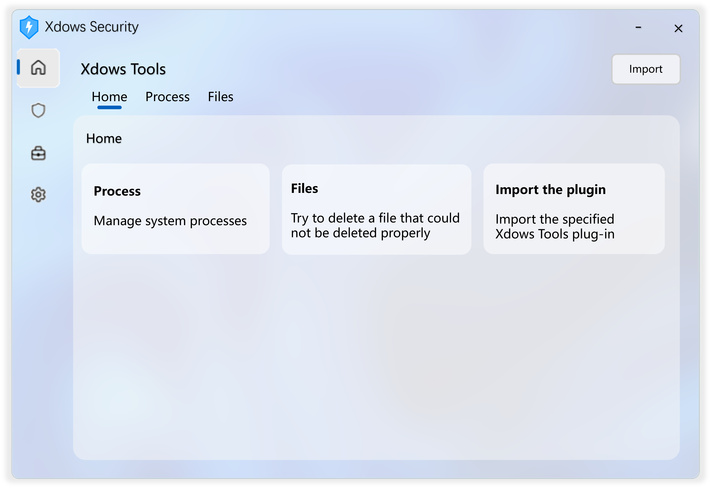

::: warning 注意
該版本已過時。建議查看最新的 [Xdows Security 4.1](/zh-HANT/Xdows-Security-4.1/get-started) 版本。
:::

# Xdows Tools

（圖片僅供參考）

## 簡介

Xdows Tools 是 Xdows Security 內置的工具集

Xdows Security 4.0 的 Xdows Tools 相比 3.0 在重新繪製 UI 的同時支援了 匯入外掛 功能

## 外掛

[請查看這裡](./Plugins/get-started.md)