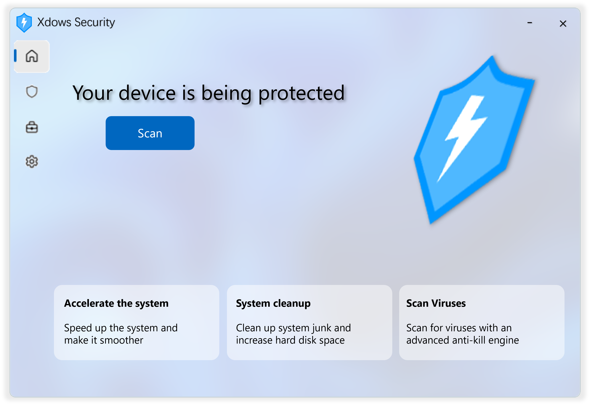

::: warning 注意
此版本已過期。建議查看最新的 [Xdows Security 4.1](/zh-HANT/Xdows-Security-4.1/get-started) 版本。
:::

# 開始使用

（圖片僅供參考）

查看下一代 Xdows Security 4.0

## 介紹 {#Info}

Xdows Security 是一款防毒軟體，旨在防禦潛在威脅並偵測病毒威脅。

## 下載 {#Download}

您現在可以下載測試版。

安裝前請閱讀 `README.txt`。

測試版僅用於測試目的，使用風險自負。

<Linkcard url="https://www.123865.com/s/1y1qVv-52LY" title="下載 Xdows Security Beta" description="目前公開測試版：4.00-Beta7" logo="/logo.ico"/>

>[!NOTE] 想取得最新測試版？
>
>加入 [TG 建構頻道](https://t.me/xdowssecurity) 以取得它（不保證測試版穩定）。
>

## 進度 {#Progress}

 - [x] 專案建立
 - [x] 防毒引擎
 - [x] UI 建立
 - [x] 連接 UI 和功能
 - [x] 發布內部測試版
 - [x] 發布公開測試版
 - [ ] 最佳化和新增功能
 - [ ] 發布正式版

## 核心 {#Kernel}

Xdows Security 3.0 和 4.0 都基於網頁技術構建其 UI，但它們與 UI 的互動方式不同。

 - 3.0 版僅在瀏覽器中載入網頁，核心透過擷取網頁上的 JavaScript 操作來達成其目的。除了 WebUI 之外，還有其他無法自訂的元件。

 - 4.0 版真正允許瀏覽器與核心之間的資料交換。它只有 WebUI，大幅提升了可自訂性。此外，UI 具有一定程度的跨平台相容性。
